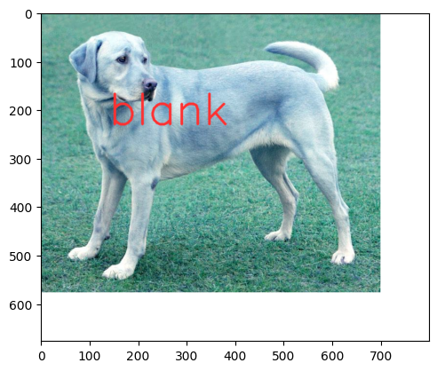

# Animal Detection Tutorial

<table align="left">
  <td>
    <a target="_blank" href="https://colab.research.google.com/github/georgia-tech-db/license-plate-recognition/blob/main/README.ipynb"> Run on Google Colab</a>
  </td>
  <td>
    <a target="_blank" href="https://github.com/georgia-tech-db/license-plate-recognition/blob/main/README.ipynb"> View source on GitHub</a>
  </td>
  <td>
    <a target="_blank" href="
    https://raw.githubusercontent.com/georgia-tech-db/license-plate-recognition/main/README.ipynb"> Download notebook</a>
  </td>
</table>
<br>
<br>

### Install Application Dependecies 


```python
!wget -nc https://raw.githubusercontent.com/jarulraj/animal-detection/main/requirements.txt
!pip -q --no-color install -r requirements.txt
```

    File ‘requirements.txt’ already there; not retrieving.
    


### Start EVA server

We are reusing the start server notebook for launching the EVA server.


```python
!wget -nc "https://raw.githubusercontent.com/georgia-tech-db/eva/master/tutorials/00-start-eva-server.ipynb"
%run 00-start-eva-server.ipynb
cursor = connect_to_server()
```

    File ‘00-start-eva-server.ipynb’ already there; not retrieving.
    
    nohup eva_server > eva.log 2>&1 &
    Note: you may need to restart the kernel to use updated packages.


### Register Animal Detection UDF


```python
cursor.execute("DROP UDF AnimalDetectorPlus;")
response = cursor.fetch_all()
print(response)
cursor.execute("""CREATE UDF IF NOT EXISTS AnimalDetectorPlus
      INPUT  (frame NDARRAY UINT8(3, ANYDIM, ANYDIM))
      OUTPUT (labels NDARRAY STR(ANYDIM), 
              scores NDARRAY FLOAT32(ANYDIM))
      TYPE  Classification
      IMPL  'animal_image_classifier.py';
      """)
response = cursor.fetch_all()
print(response)
```

    @status: ResponseStatus.SUCCESS
    @batch: 
                                                  0
    0  UDF AnimalDetectorPlus successfully dropped
    @query_time: 0.015989525942131877
    @status: ResponseStatus.SUCCESS
    @batch: 
                                                                 0
    0  UDF AnimalDetectorPlus successfully added to the database.
    @query_time: 3.3755824179388583


## Download Images


```python
!wget -nc "https://raw.githubusercontent.com/jarulraj/animal-detection/main/dog.png"
!wget -nc "https://raw.githubusercontent.com/jarulraj/animal-detection/main/giraffe.png"

# DOWNLOAD ADDITIONAL IMAGES IF NEEDED AND LOAD THEM
!tail -n 50 eva.log

cursor.execute('DROP TABLE IF EXISTS MyImages')
response = cursor.fetch_all()
print(response)

file_name = "dog.jpg"
cursor.execute('LOAD IMAGE "' + file_name + '" INTO MyImages;')
response = cursor.fetch_all()
print(response)

cursor.execute("""SELECT AnimalDetectorPlus(data)
                FROM MyImages""")
response = cursor.fetch_all()
print(response)
```

    --2023-01-14 22:53:41--  https://raw.githubusercontent.com/jarulraj/animal-detection/main/dog.png
    Resolving raw.githubusercontent.com (raw.githubusercontent.com)... 185.199.110.133, 185.199.111.133, 185.199.109.133, ...
    Connecting to raw.githubusercontent.com (raw.githubusercontent.com)|185.199.110.133|:443... connected.
    HTTP request sent, awaiting response... 404 Not Found
    2023-01-14 22:53:41 ERROR 404: Not Found.
    
    --2023-01-14 22:53:42--  https://raw.githubusercontent.com/jarulraj/animal-detection/main/giraffe.png
    Resolving raw.githubusercontent.com (raw.githubusercontent.com)... 185.199.110.133, 185.199.111.133, 185.199.109.133, ...
    Connecting to raw.githubusercontent.com (raw.githubusercontent.com)|185.199.110.133|:443... connected.
    HTTP request sent, awaiting response... 404 Not Found
    2023-01-14 22:53:42 ERROR 404: Not Found.
    
    01-14-2023 22:53:26 INFO  [catalog_manager:catalog_manager.py:_bootstrap_catalog:0077] Bootstrapping catalog
    01-14-2023 22:53:26 INFO  [base_model:base_model.py:init_db:0103] Creating tables
    01-14-2023 22:53:26 INFO  [timer:timer.py:log_elapsed_time:0045] Query Compile Time: 0.4857 sec
    01-14-2023 22:53:26 WARNING[create_udf_executor:create_udf_executor.py:exec:0042] UDF FastRCNNObjectDetector already exists, nothing added.
    01-14-2023 22:53:26 INFO  [timer:timer.py:log_elapsed_time:0045] Query Compile Time: 0.0017 sec
    01-14-2023 22:53:26 WARNING[create_udf_executor:create_udf_executor.py:exec:0042] UDF Array_Count already exists, nothing added.
    01-14-2023 22:53:26 INFO  [timer:timer.py:log_elapsed_time:0045] Query Compile Time: 0.0013 sec
    01-14-2023 22:53:26 WARNING[create_udf_executor:create_udf_executor.py:exec:0042] UDF Crop already exists, nothing added.
    01-14-2023 22:53:26 INFO  [timer:timer.py:log_elapsed_time:0045] Query Compile Time: 0.0012 sec
    01-14-2023 22:53:26 WARNING[create_udf_executor:create_udf_executor.py:exec:0042] UDF Open already exists, nothing added.
    01-14-2023 22:53:26 INFO  [timer:timer.py:log_elapsed_time:0045] Query Compile Time: 0.0014 sec
    01-14-2023 22:53:26 WARNING[create_udf_executor:create_udf_executor.py:exec:0042] UDF YoloV5 already exists, nothing added.
    01-14-2023 22:53:26 INFO  [timer:timer.py:log_elapsed_time:0045] Query Compile Time: 0.0020 sec
    01-14-2023 22:53:26 WARNING[create_udf_executor:create_udf_executor.py:exec:0042] UDF Similarity already exists, nothing added.
    01-14-2023 22:53:26 INFO  [timer:timer.py:log_elapsed_time:0045] Query Compile Time: 0.0011 sec
    01-14-2023 22:53:26 WARNING[create_udf_executor:create_udf_executor.py:exec:0042] UDF DummyObjectDetector already exists, nothing added.
    01-14-2023 22:53:26 INFO  [timer:timer.py:log_elapsed_time:0045] Query Compile Time: 0.0010 sec
    01-14-2023 22:53:26 WARNING[create_udf_executor:create_udf_executor.py:exec:0042] UDF DummyMultiObjectDetector already exists, nothing added.
    01-14-2023 22:53:26 INFO  [timer:timer.py:log_elapsed_time:0045] Query Compile Time: 0.0011 sec
    01-14-2023 22:53:26 WARNING[create_udf_executor:create_udf_executor.py:exec:0042] UDF DummyFeatureExtractor already exists, nothing added.
    01-14-2023 22:53:26 INFO  [server:server.py:start_server:0096] Start Server
    01-14-2023 22:53:26 INFO  [server:server.py:start_server:0118] PID(3318822) serving on ('0.0.0.0', 5432)
    01-14-2023 22:53:37 INFO  [timer:timer.py:log_elapsed_time:0045] Query Compile Time: 0.0015 sec
    01-14-2023 22:53:37 INFO  [timer:timer.py:log_elapsed_time:0045] Query Response Time: 0.0160 sec
    01-14-2023 22:53:37 INFO  [timer:timer.py:log_elapsed_time:0045] Query Compile Time: 0.0017 sec
    01-14-2023 22:53:41 INFO  [timer:timer.py:log_elapsed_time:0045] Query Response Time: 3.3756 sec
    @status: ResponseStatus.SUCCESS
    @batch: 
                                           0
    0  Table Successfully dropped: MyImages
    @query_time: 0.04396463208831847
    @status: ResponseStatus.SUCCESS
    @batch: 
                                0
    0  Number of loaded IMAGE: 1
    @query_time: 0.056759868981316686
    @status: ResponseStatus.SUCCESS
    @batch: 
       animaldetectorplus.labels animaldetectorplus.scores
    0  [antelope_duiker, blank]  [0.14626732, 0.43839565]
    @query_time: 1.9700300961267203


### Annotate Model Output on Image


```python
import cv2
from pprint import pprint
from matplotlib import pyplot as plt
from pathlib import Path

def annotate_image_ocr(detections, input_image_path, frame_id):
    color1=(0, 255, 150)
    color2=(255, 49, 49)
    white=(255, 255, 255)
    thickness=4

    frame = cv2.imread(input_image_path)
    height, width = frame.shape[:2]

    if frame_id == 0:
        frame= cv2.copyMakeBorder(frame, 0, 100, 0, 100, cv2.BORDER_CONSTANT,value=white)

    print(detections)
    plate_id = 0

    df = detections
    df = df[['animaldetectorplus.labels']][df.index == frame_id]

    x_offset = width * 0.2
    y_offset = height * 0.4

    if df.size:
        dfLst = df.values.tolist()
        for label in dfLst[0][0]:

            cv2.putText(frame, label, (int(x_offset), int(y_offset)), cv2.FONT_HERSHEY_SIMPLEX, 3, color2, thickness, cv2.LINE_AA) 
            y_offset = y_offset + height * 0.2

            # Show every  frame
            plt.imshow(frame)
            plt.show()

            p = Path(input_image_path)
            output_path = "{0}_{2}{1}".format(p.stem, p.suffix, "output")

            cv2.imwrite(output_path, frame)

```


```python
dataframe = response.batch.frames
annotate_image_ocr(dataframe, 'dog.jpg', frame_id = 0)
```

      animaldetectorplus.labels animaldetectorplus.scores
    0  [antelope_duiker, blank]  [0.14626732, 0.43839565]


    

    


    

    

